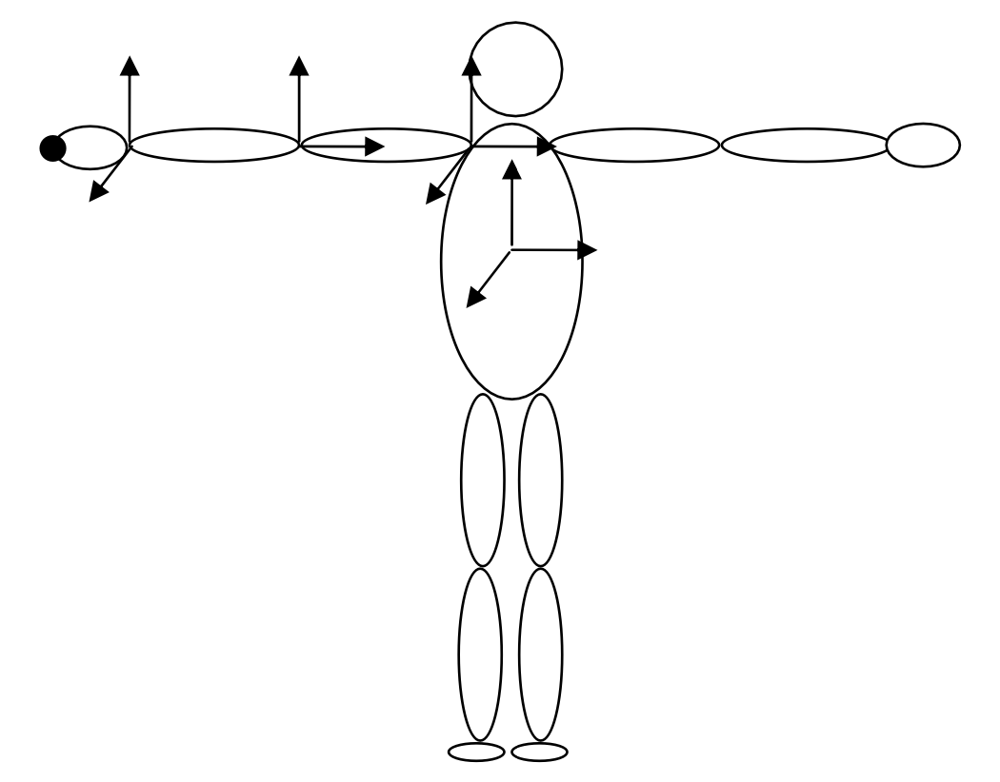
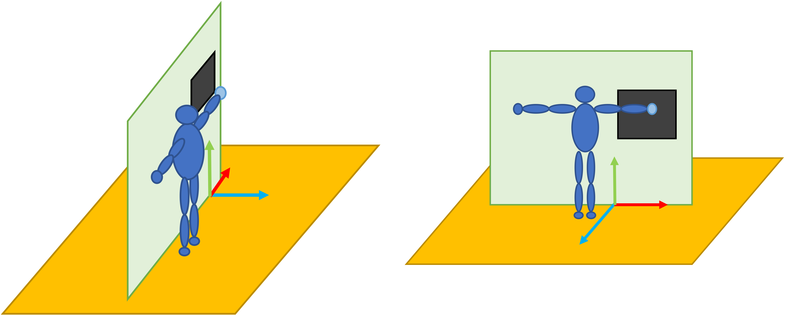
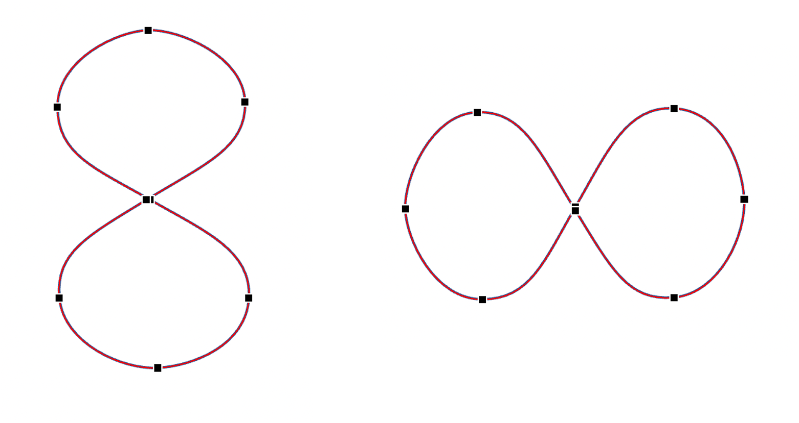

# CS 174C: Assignment 2

#### *Due Date: Check on BruinLearn*

-----------------------

### General Requirements

Your code must be implemented using the template code provided on BruinLearn. This assignment involves no text-based I/O or button events. Your animation should start and run automatically.

Create an introduction file named "README.md" (or in another format if you wish) and specify where you implement the bullet points (like "1: in line XXX-XXX", or "2: you should see XXX during the animation"). This will help the grader to check your code and not miss a point.

This assignment has a raw score of 20 points and counts 20% toward your final course grade.

### Specific Requirements

Develop an **Inverse Kinematics engine** for animating a human character positioned in front of a blackboard. During the animation, the character will draw (i.e., trace) a pre-defined spline on the blackboard.

* The end effector is the end point of the right hand (see the figure below).
* The character will remain aligned with the surface of the blackboard.
* At the start of the animation, the human character is in its rest pose, and you should put the blackboard and starting point of the spline near its right hand.
* The character should move its right hand in a straight line to touch the blackboard and then draw the spline, all with a natural speed of movement.
* The required shape of the spline is specified below.

### Grading Scheme

1. [2 Points] Display a "classroom" with a floor plane and a blackboard on a planar wall parallel to the x-y plane (perpendicular to the floor).

2. [2 Points] Display the spline on the blackboard. You can either display the spline from the beginning or gradually display it during the drawing animation.

3. [4 Points] Model the human character using ellipsoids (you can use the Sphere primitive with non-uniform scaling).

4. [8 Points] Implement the inverse kinematics solver using the pseudoinverse approach.

5. [1 Point] Move the right hand from its initial position such that the end effector touches the board (initial animation).

6. [3 Points] Then, move the hand to draw the spline, looping repeatedly, since the spline is a closed shape.

### The Character's Degrees of Freedom

- 3 translational at the root.

- 3 rotational at the shoulder: first around x, then around y, then around z.

- 2 rotational at the elbow: first around x, then around y.

- 2 rotational at the wrist: first around y, then around z.

### Illustration of the Rest Pose

The character in its rest pose, with all its degrees of freedom set to zero, should look as shown in the following figure, in which the character is facing you and the end effector (black dot) is the tip of the right hand. The length of each limb is up to you.

In the figure below, the character is facing the wall and backboard, and the right-hand end effector is indicated in a different color.

Of course, make sure that the blackboard is within the reachable space of the character's right arm. You needn’t perform any computations; just place the blackboard at a distance that works. This way you are free to specify the size of the links, as you wish. If you want, make the character prettier to look at.

### Spline to Draw

Reuse your spline code from Assignment 1.
If your UID ends with an odd number, draw an "8" shape, and if your UID ends with an even number, draw an "∞" shape, as shown below. The starting point of your spline should be at the center of the shape.

### Suggested Steps

1. First model the character and make sure you understand how to set its degrees of freedom.

2. Compute the Jacobian.

3. Compute the pseudoinverse of the Jacobian.

4. Incorporate a linear system solver.

5. Test simple cases. For example, use an offset ∆E and have the character move its end effector to that position.

6. Once you have verified that the math is correct, use linear interpolation to animate the right arm and such that the end effector moves from its initial position to the beginning of the spline.
   
7. Once the end effector is at the start of the spline, advance its position along the spline path with constant velocity.

8. Beautify the scene if you wish.
