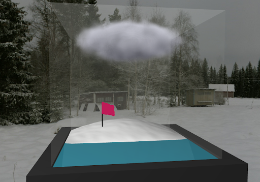
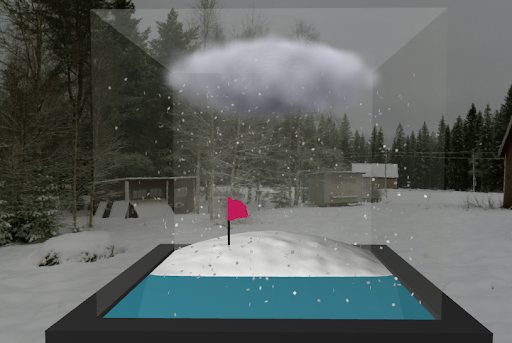
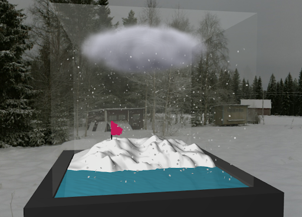
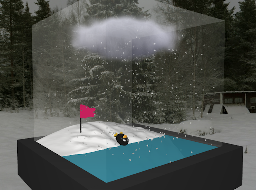

# The Snow Globe

### Scene Design

The goal of our group project is to render a snow globe, similar to the ones found in a souvenir shop. The basis of our snow globe scene is a glass box that contains snowy terrain, a body of water, a cloud, and a flag. These are the things rendered at the very beginning of our animation. In addition, a penguin will periodically spawn, which will then slide down the slope generating a splash in the water. Our project was heavily inspired by the many short films shown in the beginning of lectures, where we sought to strike a balance between realism (accurate physics, reflections, environment mapping, etc) and fantasy (animated characters, exaggerated motion, whimsical setting, etc) similar to works like Pixar’s Toy Story.

Snowflakes are generated once the animation begins. Three snowflakes are spawned every frame, each with a randomized initial velocity. 

The height of the terrain increases over time, reflecting the effect of snowflakes accumulating on the ground. The terrain could be reset to its initial status by the clear terrain button.

Every once in a while, a penguin will dash into the water body from the top of the snowy terrain. Observe that the penguin both interacts with the snow on the ground, leaving a trail behind its route, but also with the water causing a splash on the surface of the water.

Besides these main functionalities, there are a few extra features that can be toggled on and off using the interactive buttons. The toggle spin button turns on/off the velocity field that spins the snowflakes around the horizontal center of the glass box. When this feature is toggled on, snowflakes would circle around the globe while falling to the ground. This feature produces some interesting snow distribution on the terrain. The toggle wind button turns on/off the mass-spring-damper system that allows the flag to be moved around as if it’s been blown by the wind. Note that this same wind also affects the motion of the snow particles as well and they will go in the direction that the flag is blowing in. The rotate wind button changes the direction of the wind and subsequently changes the direction in which the flag is blown as well as the snowflakes. The toggle cloud button draws/removes the volumetric cloud. 

### Computer Animation Algorithms

#### Particle System
Our snow system is an advanced particle system which accounts for both wind and gravity using forces as well as velocity fields. Particles are spawned in a uniform distribution to cover the entire surface of the cube. Each snowflake is rendered using sprites with textures containing an alpha channel as taught in the lecture. Size, orientation, spin, and initial velocity are randomized to give the snowfall a natural appearance. If the velocity field is toggled on, the snowflakes would undergo a circular movement on the X-Z plane, as if affected by a tornado. Our snowflake system also interacts with the wind which can be dynamically set by the user.

#### Collision Detection 
Our snow particle system accurately collides with both the glass walls and the terrain. When the snow collides with the terrain, this causes snow to accumulate on the ground which is modeled using parametric surfaces. The snow that builds up along the wall is also accounted for and is modeled with parametric surfaces as well.
Cloth Simulation:
The flag in our scene is implemented by cloth simulation using a mass-spring-damper system. It is constructed with m x n particles interconnected with springs between each two rows and columns. Particles are subject to gravity, wind, and spring forces. If the velocity field is toggled on, the flag will interact with the wind.

#### Fluid Simulation
We model our body of water using a fluid simulation that is capable of running in real-time, implemented using height fields. This not only interacts with the glass walls and the jumping penguin, but also with the snowy terrain as well; as the terrain grows around the water, this will affect the ripples that bounce off the terrain.

#### Volumetric Cloud
We model a volumetric cloud using fractal brownian motion, 3d dimensional noise, and raymarching. Since we use raymarching, the entirety of the cloud is drawn in clip space in the fragment shader. The noise is chosen specifically to appear natural, similar to perlin noise as taught in lecture.

#### Character Animation
Our penguin is animated using several advanced features. First, we use motion curves to model the trajectory of the penguin sliding down the slope. However, it does not make sense for the penguin to travel at a constant velocity since the penguin should be accelerating as it goes down the slope. Because of this, we also use the principle of ease in and ease out, to accurately simulate the velocity of the penguin as well so that it will accelerate naturally from the force of gravity. Lastly, we use frenet frames to accurately model the penguin orientation as well so that it will be facing tangential to the slope.

#### Reflection, Refraction, and Environment Mapping
While less related to 174C and more to 174A, we also include some fun shaders as well to improve the realism of the scene as well. We built our own shaders to use cube maps to both simulate reflection and refraction as to more accurately render the glass. In addition, the environment is rendered using the same cube map as well which is done in screen space based on the camera orientation with the z depth set to the maximum, as opposed to actually drawing a large cube and drawing a texture on each face individually, which is much more efficient.  

### Division of work

- Ethan Yang: Advanced shaders, fluid simulation, volumetric clouds, terrain & surface accumulation system, character animation.
- Yuan Shen: Cloth simulation using spring-mass-damper system.
- Zihan Liu: Zihan mainly worked on the velocity field and collision detection part. Additionally, Zihan wrote many bugs. 

### Reference & External Resources

**Environment mapping**: https://webglfundamentals.org/webgl/lessons/webgl-skybox.html

**Reflection**: https://webglfundamentals.org/webgl/lessons/webgl-environment-maps.html

**Volumetric clouds**: https://codesandbox.io/s/um3dvk?file=/src/shaders.js:16-49

**3D Noise for Volume Raycasting**: https://www.shadertoy.com/view/lss3zr

**Water with height fields**: https://ubm-twvideo01.s3.amazonaws.com/o1/vault/gdc08/slides/S6509i1.pdf

**Velocity Field**:  https://www.youtube.com/watch?v=yOySK5FSosQ

**Collision Detection**: https://learnopengl.com/In-Practice/2D-Game/Collisions/Collision-detection

**Cloth Simulation**: 
- https://github.com/ndrwhr/cloth-simulation/blob/master/source/cloth.js
- https://codepen.io/thomcc/pen/NGQpxv

